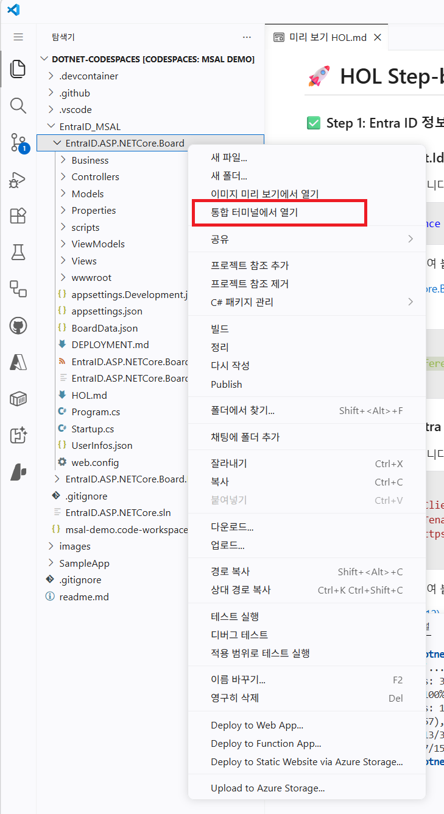
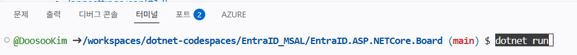
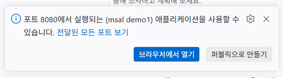
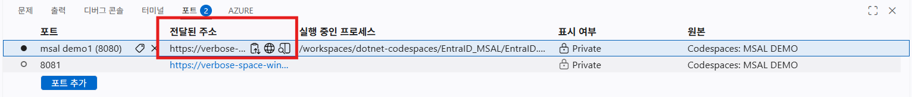
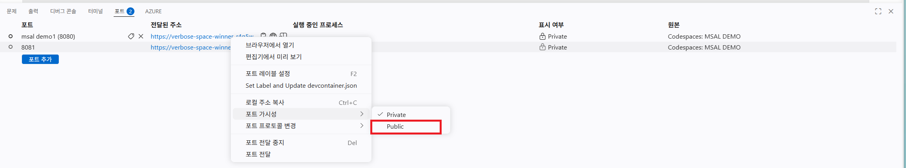

# 🚀 HOL Step-by-Step

### ✅ Step 0: AS-IS 앱 동작 확인
1. EntraID.ASP.NETCore.Board 앱을 왼쪽 탐색기에서 확인 후 마우스 우클릭하여 "통합 터미널에서 열기"를 선택합니다.



2. 화면 하단의 터미널 창에 다음 명령어를 실행하여 게시판 앱을 실행합니다.
```cmd
dotnet run
```


이 후 오른쪽 아래 영역에 나타나는 "브라우저에서 열기" 버튼을 클릭하면 앱이 새 탭에 표시됩니다.



만약 해당 창이 나타나지 않는 경우에는 하단 탭 중 "포트" 탭을 선택하여 8080 으로 서비스 중인 앱을 찾아 마우스 우클릭을 통해 브라우저에서 다시 열 수 있습니다.



마지막으로 이 후 원활한 진행을 위해 로그아웃 후 터미널 창에서 Ctrl+C 를 통해 실행중인 앱을 종료합니다.

### ✅ Step 1: Entra ID 정보 확인 및 App Registration 등록 (1/7)
**`- 이후 진행에서는 진행과정에 필요한 정보를 수집하여 기록하며 진행합니다. 왼쪽 탐색기 창에서 "실습.txt"파일에 기록합니다.`**

1. Entra ID 인증 후 되돌아갈 주소 확인 및 포트 외부 접근 허용

하단 탭 중 "포트" 탭을 선택하여 8080으로 서비스 중인 앱을 찾아 마우스 우클릭 후 "포트 가시성" 을 선택 후 "Private" -> 에서 "Public"으로 변경합니다.



다시 8080으로 서비스 중인 앱을 우클릭 후 "로컬 주소 복사" 버튼을 통해 주소를 복사합니다.  
복사한 주소를 "실습.txt"파일의 OIDC Callback에 복사하여 아래와 같은 주소를 만듭니다.

ex) OIDC Callback  
https://verbose-space-winner-r4g5wqr74rjwfxjg-8080.app.github.dev/signin-oidc  
https://verbose-space-winner-r4g5wqr74rjwfxjg-8080.app.github.dev/signout-callback-oidc

2. Entra ID App Registration 등록
3. [Entra ID 관리센터](https://entra.microsoft.com) 에 관리자 계정으로 로그인합니다.
4. 왼쪽 메뉴에서 "앱 등록" 으로 이동
5. "+ 새 등록" 버튼을 통해 앱 등록을 시작합니다.
6. 앱의 이름을 "MSAL DEMO" 로 지정합니다.(중복을 피하기 위해 각자에게 할당된 일련번호를 추가로 입력합니다.)
7. 지원되는 계정 유형 : 단일 테넌트만 - {테넌트 명}
8. "등록" 버튼을 통해 저장합니다.
9. 앱의 속성 중 "애플리케이션(클라이언트) ID" 항목을 찾아 복사하여 "실습.txt" 파일에 복사합니다.
10. 앱의 속성 중 "디렉터리(테넌트) ID" 항목을 찾아 복사하여 "실습.txt" 파일에 복사합니다.
11. "Authentication (Preview)" 메뉴로 이동
12. "+ 리디렉션 URI 추가" 버튼 선택 웹 어플리케이션에서 "웹"을 선택한 후 위의 1번 단계에서 기록한 OIDC Callback URL을 하나씩 총 2번 입력합니다. (선택 시 ID 토큰 체크)


### ✅ Step 2: Microsoft.Identity.Web 패키지 추가 (2/7)
1. 다음 내용을 복사합니다.
```xml
    <PackageReference Include="Microsoft.Identity.Web" Version="4.8.0" />
```
2. 아래 링크를 클릭하여 붙여넣기 합니다.
- [/EntraID.ASP.NETCore.Board.csproj(#9)](./EntraID.ASP.NETCore.Board.csproj#L9)
<br/>

3. ✔️ 확인
```diff
 8: <ItemGroup>
+9:     <PackageReference Include="Microsoft.Identity.Web" Version="4.8.0" />
10: </ItemGroup>
```

### ✅ Step 3: MSAL Entra ID 연결 정보 추가  (3/7)
1. 다음 내용을 복사합니다.
```json
,"EntraID": {
    "ClientID": "{ClientID}",
    "TenantID": "{TenantID}",
    "Instance": "https://login.microsoftonline.com/"
  }
```
2. 아래 링크를 클릭하여 붙여넣기 합니다. Demo 진행과정에서 확인된 Entra ID 테넌트 ID와 App Registration의 Client ID로 교체합니다.
- [/appsettings.json(#12)](appsettings.json#L12)
<br/>

3. ✔️ 확인
```diff
{
        ...
  9:	"AllowedHosts": "*",
 10:	"UserInfo": "UserInfos.json",
 11:	"BoardData": "BoardData.json"
+12:    , "EntraID": {
+13:		"ClientID": "{ClientID}",
+14:		"TenantID": "{TenantID}",
+15:		"Instance": "https://login.microsoftonline.com/"
+16:	}
} 
```

### ✅ Step 4: 컨테이너에 MSAL 인증 서비스 등록  (4/7)
1. 다음 내용을 복사합니다.
```csharp
using Microsoft.Identity.Web;
```
2. 아래 링크를 클릭하여 붙여넣기 합니다.
- [/Startup.cs(#7)](Startup.cs#L7)
<br/>

3. ✔️ 확인
```diff
 6: using Microsoft.AspNetCore.HttpOverrides;
+7: using Microsoft.Identity.Web;
 8: 
 9: namespace EntraID.ASP.NETCore.Board
```

4. 다음 내용을 복사합니다.
```csharp
     		services
      			.AddAuthentication(Microsoft.AspNetCore.Authentication.OpenIdConnect.OpenIdConnectDefaults.AuthenticationScheme)
      			.AddMicrosoftIdentityWebApp(idOptions => 
      			{
          			idOptions.TenantId = Configuration.GetValue<string>("EntraID:TenantID");
          			idOptions.ClientId = Configuration.GetValue<string>("EntraID:ClientID");   
          			idOptions.Instance = Configuration.GetValue<string>("EntraID:Instance");
      			});
```

5. 아래 링크를 클릭하여 붙여넣기 합니다.
- [/Startup.cs(#23)](Startup.cs#L23)
<br/>

3. ✔️ 확인
```diff
 27: public void ConfigureServices(IServiceCollection services)
 28: {
+29:     services
+30:        .AddAuthentication(OpenIdConnectDefaults.AuthenticationScheme)
+31:        .AddMicrosoftIdentityWebApp(idOptions => 
+32:        {
+33:            idOptions.TenantId = Configuration.GetValue<string>("EntraID:TenantID");
+34:            idOptions.ClientId = Configuration.GetValue<string>("EntraID:ClientID");   
+35:            idOptions.Instance = Configuration.GetValue<string>("EntraID:Instance");
+36:        });
 37:    services.AddControllersWithViews();
 38:    // 앱의 게시판 기능 추가
 39:    services.AddSingleton<BoardManager>(new BoardManager(Configuration.GetValue<string>("BoardData")));
 40: }
```

### ✅ Step 5: MSAL 인증 흐름 시작 & 흐름 완료 코드 추가  (5/7)
1. 다음 내용을 복사합니다.
```csharp
using System;
using System.Web;
using Microsoft.AspNetCore.Mvc;
using Microsoft.AspNetCore.Authentication;
using Microsoft.AspNetCore.Authentication.OpenIdConnect;

namespace EntraID.ASP.NETCore.Board.Controllers
{
	public class MsalAuthenticationController : BoardBaseController
	{
		public IActionResult SignIn(string returnUrl)
		{
			if(string.IsNullOrWhiteSpace(returnUrl))
				returnUrl = Url.Action("Index", "Board");
			if(signInManager.IsAuthenticated)
				return Redirect(returnUrl);
			else
				return Challenge( new AuthenticationProperties { RedirectUri = Url.Action(nameof(SignInCompleted), new { returnUrl = HttpUtility.UrlEncode(returnUrl) }) }, OpenIdConnectDefaults.AuthenticationScheme);
		}

		public IActionResult SignInCompleted(string returnUrl)
		{
			if(!User.Identity.IsAuthenticated)
				throw new Exception("MSAL 인증이 완료되었지만, ASP.NET Core 인증이 되지 않았습니다.");
			else
			{
				if(!signInManager.Login(User, Response))
					throw new Exception("MSAL 인증은 완료되었지만, 인증을 완료한 사용자는 없는 사용자 입니다.");

				if (string.IsNullOrWhiteSpace(returnUrl))
					returnUrl = Url.Action("Index", "Board");

				return Redirect(HttpUtility.UrlDecode(returnUrl));
			}
		}
	}
}
```
2. 아래 링크를 클릭하여 붙여넣기 합니다.
- [/Controllers/MsalAuthenticationController.cs(#1)](./Controllers/MsalAuthenticationController.cs#L1)
<br/>

3. ✔️ 확인
```diff
+ (빈 파일에서 복사한 내용 전체 추가)
```
### ✅ Step 6: MSAL 인증 완료 확인  (6/7)
1. 다음 내용을 복사합니다.
```csharp
        public bool Login(IPrincipal userPrincipal, HttpResponse response)
		{
			if(!userPrincipal.Identity.IsAuthenticated)
			{
				setNoAuthn();
				return false;
			}

			var claimsIdentity = (userPrincipal.Identity as ClaimsIdentity);
			var userName = claimsIdentity.FindFirst(Microsoft.Identity.Web.ClaimConstants.PreferredUserName).Value; 
			UserInfo userInfo = UserManager.GetUserInfoByEmail(userName);

			if(userInfo == null)
			{
				setNoAuthn();
				return false;
			}
			
			saveSignIn(userInfo.DisplayName, userInfo.UserName, true, DateTime.Now, response);
			return true;
		}
```
2. 아래 링크를 클릭하여 붙여넣기 합니다.
- [/Business/SignInManager.cs(#100)](./Business/SignInManager.cs#L100)
<br/>

3. ✔️ 확인
```diff
+100:  public bool Login(IPrincipal userPrincipal, HttpResponse response)
+101:	{
+102:		if(!userPrincipal.Identity.IsAuthenticated)
+103:		{
+104:			setNoAuthn();
+105:			return false;
+106:		}
+107:
+108:		var claimsIdentity = (userPrincipal.Identity as ClaimsIdentity);
+109:		var userName = claimsIdentity.FindFirst(Microsoft.Identity.Web.ClaimConstants.PreferredUserName).Value; 
+110:		UserInfo userInfo = UserManager.GetUserInfoByEmail(userName);
+111:
+112:		if(userInfo == null)
+113:		{
+114:			setNoAuthn();
+115:			return false;
+116:		}
+117:		
+118:		saveSignIn(userInfo.DisplayName, userInfo.UserName, true, DateTime.Now, response);
+119:		return true;
+120:	}
```
### ✅ Step 7: 인증 진입점 및 MSAL 로그아웃 적용  (7/7)
1. 다음 내용을 복사합니다.
```csharp
     		return RedirectToAction("SignIn", "MsalAuthentication", new { returnUrl = returnUrl });
```
2. 아래 링크를 클릭하여 붙여넣기 합니다. AS-IS 로그인 페이지로 이동하는 19행은 //를 코드 앞에 붙여 주석처리를 한 후 20행에 새로운 내용을 붙여넣기 합니다.
- [/Controllers//HomeController.cs(#19)](./Controllers//HomeController.cs#L19)
<br/>

3. ✔️ 확인
```diff
-19: return View(new LoginViewModel(signInManager.LoginSession) { InvalidCredential = false, ReturnUrl = returnUrl})
+19: //return View(new LoginViewModel(signInManager.LoginSession) { InvalidCredential = false, ReturnUrl = returnUrl})
+20: return RedirectToAction("SignIn", "MsalAuthentication", new { returnUrl = returnUrl });
```

4. 다음 내용을 복사합니다.
```csharp
			return SignOut(
				new Microsoft.AspNetCore.Authentication.AuthenticationProperties {RedirectUri = Url.Action("Index", "Board")},
				Microsoft.AspNetCore.Authentication.OpenIdConnect.OpenIdConnectDefaults.AuthenticationScheme,
				Microsoft.AspNetCore.Authentication.Cookies.CookieAuthenticationDefaults.AuthenticationScheme);
```

5. 아래 링크를 클릭하여 붙여넣기 합니다.
- [/Controllers//HomeController.cs(#28)](./Controllers//HomeController.cs#L28)
<br/>

3. ✔️ 확인
```diff
-28: return RedirectToAction("Index", "Board");
+28: //return RedirectToAction("Index", "Board");
+29: return SignOut(
+30:	new Microsoft.AspNetCore.Authentication.AuthenticationProperties {RedirectUri = Url.Action("Index", "Board")},
+31:     	Microsoft.AspNetCore.Authentication.OpenIdConnect.OpenIdConnectDefaults.AuthenticationScheme,
+32:		Microsoft.AspNetCore.Authentication.Cookies.CookieAuthenticationDefaults.AuthenticationScheme);
```

### ✅ 결과 확인
1. EntraID.ASP.NETCore.Board 앱을 왼쪽 탐색기에서 확인 후 마우스 우클릭하여 "통합 터미널에서 열기" 선택


2. 터미널 창에서 다음 명령어를 복사하여 붙여넣어 앱 빌드
```cmd
dotnet build
```

3. 터미널 창에서 다음 명령어를 복사하여 붙여넣어 앱 실행
```cmd
dotnet run
```